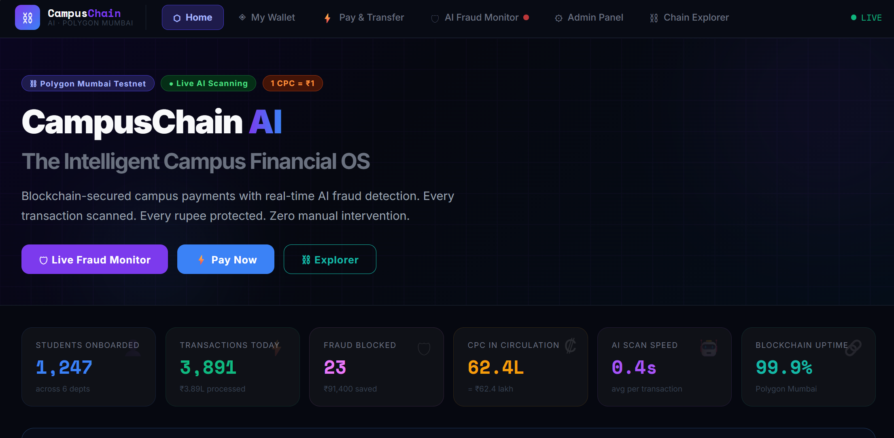
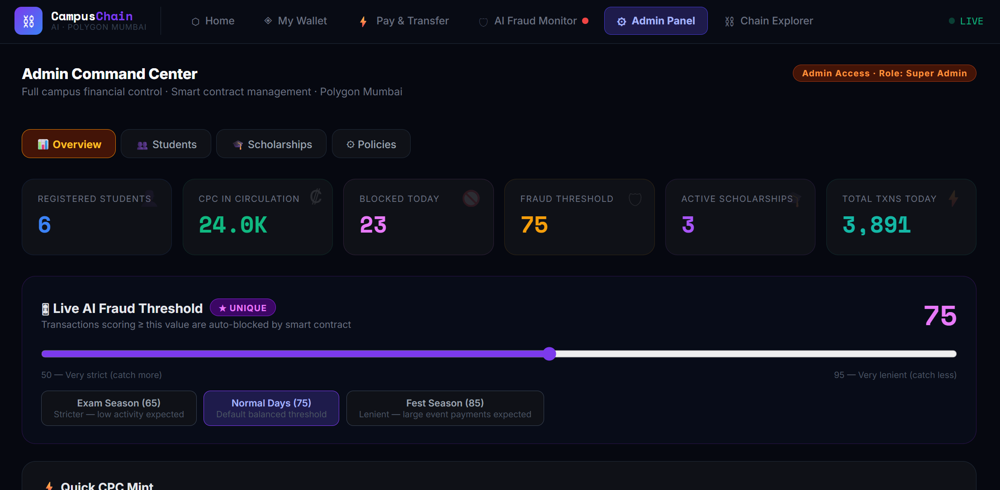
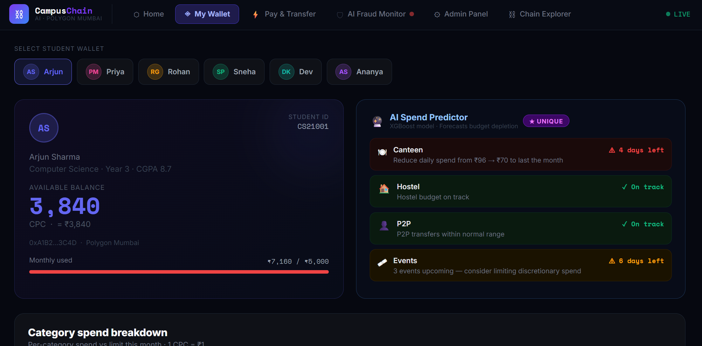

# ⛓ CampusChain

### AI-Powered Blockchain Campus Payment Ecosystem

CampusChain is a full-stack blockchain-based campus finance platform that enables secure digital payments, wallet management, transaction monitoring, and AI-assisted fraud detection within a university ecosystem.

Built using React, Solidity, Hardhat, Polygon, and Python, the platform combines smart contracts with intelligent transaction analysis to create a secure and transparent payment environment for students and administrators.

## 📸 Project Preview

### 🏠 Landing Page

### 🛡️ Admin Panel

### 👛 My Wallet

---

## ✨ Key Features

* 👛 CampusCoin digital wallet system
* 💸 Peer-to-peer payments and transfers
* ⛓️ Blockchain-powered transaction recording
* 🤖 AI-based fraud detection engine
* 📊 Real-time transaction monitoring
* 🛡️ Administrative control dashboard
* 🔍 Blockchain explorer for transaction verification
* 🔐 Smart contract security and automation

---

## 🏗️ System Modules

### 👛 My Wallet

Manage balances, view transaction history, and perform secure transfers using CampusCoin.

### 💸 Pay & Transfer

Execute peer-to-peer transactions across the campus ecosystem with blockchain-backed verification.

### 🛡️ Admin Panel

Monitor activity, review transactions, and manage platform operations from a centralized dashboard.

### ⛓️ Chain Explorer

View and verify blockchain transactions with complete transparency and auditability.

### 🤖 AI Fraud Monitor

Analyze transaction behavior using anomaly detection techniques to identify suspicious activity in real time.

---

## 🎯 Project Objective

Traditional campus payment systems often lack transparency, intelligent monitoring, and secure transaction tracking.

CampusChain addresses these challenges by combining:

* Blockchain technology for trust and transparency
* Smart contracts for automated enforcement
* AI-powered fraud analysis for risk detection
* Modern web technologies for accessibility and usability

The result is a secure digital payment ecosystem designed specifically for campus environments.
